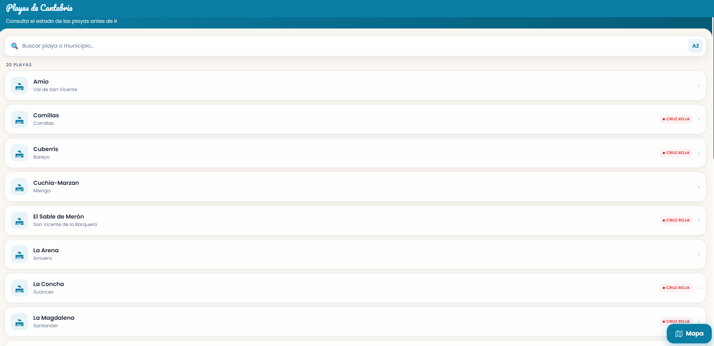
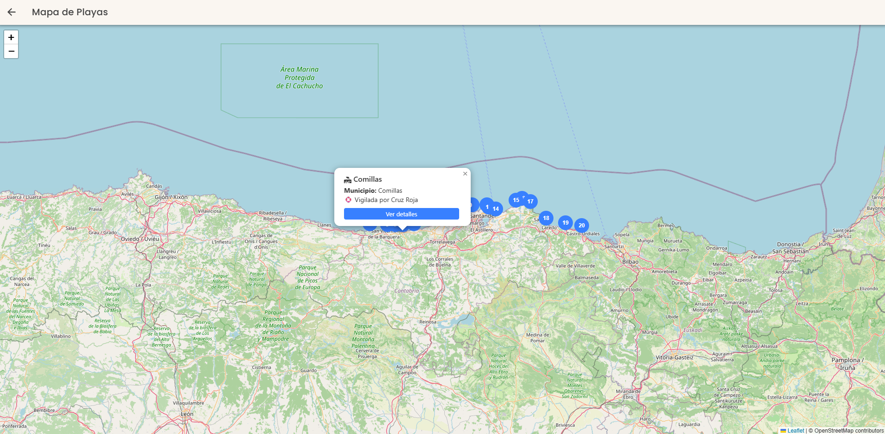
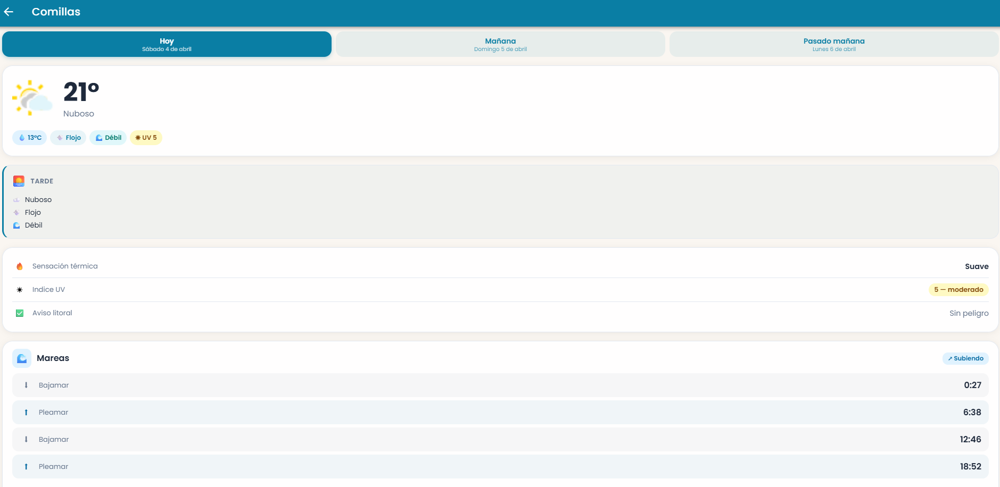

# 🏖️ Beaches of Cantabria
*Check the status of the beaches of Cantabria in real time. This application provides detailed information about waves, wind, temperature, tides, and the Red Cross flag status.*

---

[](../../releases)  
[](./LICENSE)
  
  
  
  
  
  

📖 Available languages: [Spanish](README.md) | **English**

## 🚀 Production Demo

You can try the client application consuming this API here:

👉 **https://playas-cantabria-front.web.app/**

## 📸 Preview





## 🐚 Features

* 🏝️ **Beach listing:** View all the beaches in Cantabria.  
* 🌊 **Beach details:** Get detailed information for each beach, including:  
  * 🌬️ Sea conditions (waves and wind).  
  * 🌡️ Water and air temperature.  
  * 🚩 Flag status from the Red Cross.  
* 🔍 **Search and filter:** Easily find the beach you're looking for.  
* 📍 **Location:** Explore beaches on the map using your current position with OpenStreetMap.  

## ✨ Key Highlights

* **Consolidated Data:** Aggregates information from multiple sources for a unified view:  
  * **AEMET:** Weather data and forecasts.  
  * **OpenWeatherMap:** Weather data as a fallback source.  
  * **Red Cross:** Flag status and lifeguard services.  
* **RESTful API:** Clear and predictable endpoints for beach lists and details.  
* **Cache Layer:** In-memory cache to reduce latency and external requests.  
* **Centralized Error Handling:** Middleware for consistent error management.  
* **Scalable Design:** Hexagonal architecture allows adding or replacing data sources with minimal impact.  
* **Flexible Configuration:** Environment variables for different environments (dev, prod).  

---

## 🏛️ Backend Architecture

The backend follows a **Hexagonal Architecture** (aka **Ports and Adapters**). This pattern isolates the business core from external dependencies like databases, third-party APIs, or the UI.

### Layers

1. **`Domain` (The Core)**  
   * **Contents:** Pure business logic, domain rules, `Entities` (e.g. `Beach`, `Weather`), and `Ports` (interfaces such as `IBeachRepository`, `IWeatherProvider`).  
   * **Key Rule:** No dependencies on other layers.  

2. **`Application` (Orchestration)**  
   * **Contents:** Orchestrates data flow and applies domain use cases. Contains `Application Services` used by input adapters (e.g. API controllers).  
   * **Key Rule:** Depends on `Domain`, not on `Infrastructure`.  

3. **`Infrastructure` (The Outside)**  
   * **Contents:** Implements `Ports` defined in the domain. Contains `Adapters` interacting with the outside world.  
   * **Examples:**  
     * **Express API** (entry point).  
     * **Repositories** (data persistence, JSON-based).  
     * **Third-party Providers** (AEMET, OpenWeatherMap, Red Cross).  
     * **Dependency Injection container.**  

---

## 🛠️ Tech Stack

### Backend

* **Language:** [TypeScript](https://www.typescriptlang.org/) v5.5  
* **Runtime:** [Node.js](https://nodejs.org/) v20+  
* **Framework:** [Express.js](https://expressjs.com/) v4.19  
* **Architecture:** Hexagonal (Ports & Adapters) + DI  
* **Validation:** [Zod](https://zod.dev/)  
* **HTTP:** [Axios](https://axios-http.com/) v1.7  
* **Scraping:** [Cheerio](https://cheerio.js.org/) v1.0  
* **Environment:** [Dotenv](https://github.com/motdotla/dotenv)  
* **Logging:** [Winston](https://github.com/winstonjs/winston)  
* **Deployment:** [Firebase Functions](https://firebase.google.com/docs/functions)  

### Frontend

* **Framework:** [React](https://reactjs.org/)  
* **UI:** [Ionic](https://ionicframework.com/)  
* **Language:** [TypeScript](https://www.typescriptlang.org/)  
* **Router:** [React Router](https://reactrouter.com/)  
* **Mobile Platform:** [Capacitor](https://capacitorjs.com/)  

---

## 📁 Project Structure (Backend)

```
backend/src/
├── application/    # Orchestration & application services
│   ├── dtos/
│   ├── mappers/
│   └── services/
├── domain/         # Business core
│   ├── entities/
│   ├── ports/
│   └── use-cases/
├── infrastructure/ # Implementations of ports & adapters
│   ├── cache/
│   ├── config/
│   ├── di/
│   ├── express/    
│   ├── firebase/
│   ├── providers/  
│   └── repositories/
└── index.ts
```

---

## 🚀 Getting Started

### Prerequisites
* Node.js 20+  
* Package manager: npm, yarn, or pnpm  

### Installation

```bash
git clone https://github.com/your-user/playas-cantabria.git
cd playas-cantabria

# Backend
cd backend
npm install
cp .env.tmp .env

# Fill .env with your API keys

# Frontend
cd ../frontend
npm install
```

---

## 🏃 Run the App

* Backend → http://localhost:4000  
* Frontend → http://localhost:8100  

```bash
# Backend
cd backend
npm run dev

# Frontend
cd frontend
npm start
```

---

## 🔌 API Examples

```bash
# Beach list
curl -X GET "http://localhost:4000/api/beaches" -H "Accept: application/json"

# Beach details
curl -X GET "http://localhost:4000/api/beaches/3908503/details" -H "Accept: application/json"

# Basic beach info
curl -X GET "http://localhost:4000/api/beaches/3908503" -H "Accept: application/json"
```

---

## 🤝 Contributions
Contributions are welcome! Open an *issue* with your ideas, suggestions, or bug reports.  

---

## 📜 License
MIT No Commercial (MIT + NC). See [LICENSE](./LICENSE).  

## 📌 Versioning
Follows [Semantic Versioning](https://semver.org/).  
Currently **v1.0.0**.  

## 🗺️ Roadmap
- [ ] Add more beaches  
- [ ] Add **tide data**  
- [ ] Improve **frontend architecture**  
- [ ] Publish **OpenAPI/Swagger**  
- [ ] Add basic E2E tests (Playwright)  
