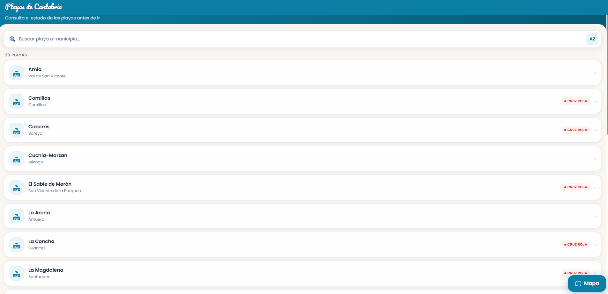
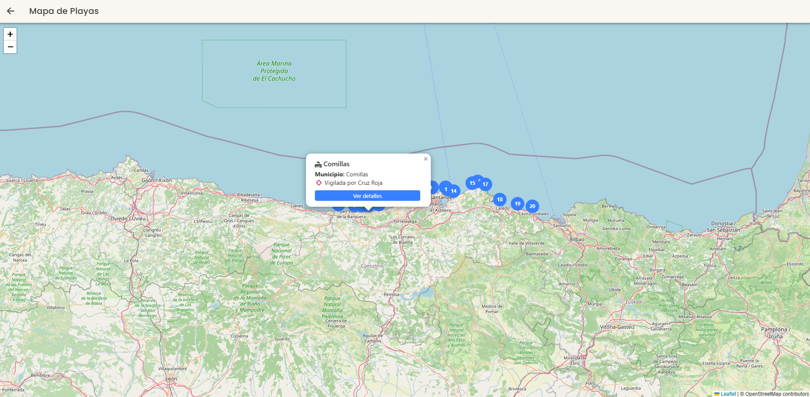
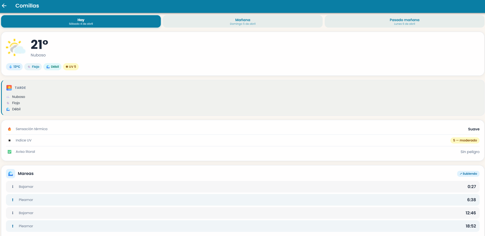

# 🏖️ Beaches of Cantabria
*Check the status of the beaches of Cantabria in real time. This app provides 3-day forecasts with morning/afternoon detail, tides, UV index, weather warnings, and Red Cross flag status.*

---

[](../../releases)
[](./LICENSE)


Available languages: [Español](README.md) | **English**

## Production Demo

Try the app here: **[https://playas-cantabria-front.web.app/](https://playas-cantabria-front.web.app/)**

Backend API: `https://playas-cantabria.onrender.com`

## Preview





## Features

* **Beach listing** with search by name or municipality and A-Z / Z-A sorting.
* **Beach detail** with full information:
  * 3-day forecast with day selector (Today, Tomorrow, Day after tomorrow) and date display.
  * Morning/afternoon breakdown: sky, wind and wave conditions for each half of the day.
  * Max temperature, water temperature and thermal sensation.
  * UV index with color-coded levels.
  * Weather warnings with severity level.
  * Tides: high and low tide times, with a real-time rising/falling indicator for today.
  * Red Cross: flag status, coverage dates and lifeguard schedule.
  * "Get directions" button that opens Google Maps with directions to the beach.
* **Interactive map** (Leaflet/OpenStreetMap) with your current location and direct access to beach details.
* **Partial offline mode:** if the backend doesn't respond within 2.5s, the beach list is served from a local JSON file and updated when the server replies.

## Data Sources

The app aggregates information from multiple sources with a fallback chain:

* **AEMET (XML/HTML scraping):** Enriched 3-day forecast, tides, warnings and real UV (primary source).
* **AEMET OpenData API:** 2-day forecast as fallback.
* **OpenWeatherMap:** Weather data, estimated UV and tomorrow's forecast as last resort.
* **Red Cross:** Flag status and lifeguard services (scraping).

In-memory cache with configurable TTL (default 300s) and singleflight deduplication.

---

## Backend Architecture

The backend follows a **Hexagonal Architecture** (Ports & Adapters). Dependencies always point inward: `infrastructure → application → domain`.

### Layers

1. **`Domain` (Core)**
   * Entities: `Beach`, `Weather`, `Flag`, `Tides`, `BeachForecast`.
   * Ports (interfaces): `BeachRepository`, `WeatherProvider`, `FlagProvider`, `TidesProvider`.
   * Use cases: `GetAllBeaches`, `GetBeachById`, `GetBeachDetails`.
   * **No dependencies** on other layers.

2. **`Application` (Orchestration)**
   * DTOs: `BeachDTO`, `BeachDetailsDTO`.
   * Mappers: `BeachMapper`, `LegacyDetailsMapper`.
   * Services: `LegacyDetailsAssembler` (orchestrates the fallback chain).
   * Validation: Zod schemas for route parameters.

3. **`Infrastructure` (Outside)**
   * Express: Server, routes, middlewares.
   * Providers: `AemetBeachWebScraper`, `AemetBeachForecastProvider`, `OpenWeatherWeatherProvider`, `RedCrossFlagProvider`.
   * Repository: `JsonBeachRepository` (reads from static JSON).
   * Cache: `InMemoryCache` with TTL and singleflight.
   * DI: Manual container with no framework (`dependencies.ts`).

### Fallback Chain (beach detail)

```
Layer 1: AemetBeachWebScraper         → Public XML/HTML from aemet.es (3 days, morning/afternoon, tides, warnings, UV)
Layer 2: AemetBeachForecastProvider   → OpenData API with API key (2 days)
Layer 3: OpenWeatherWeatherProvider   → OpenWeather API (temp, wind, description)
Layer 4: GetBeachDetails              → AEMET observation ↔ OpenWeather (hedged, first to respond wins)
```

---

## Tech Stack

### Backend

* **Language:** [TypeScript](https://www.typescriptlang.org/) v5.5
* **Runtime:** [Node.js](https://nodejs.org/) v20+
* **Framework:** [Express.js](https://expressjs.com/) v4.19
* **Architecture:** Hexagonal (Ports & Adapters) with manual DI.
* **Validation:** [Zod](https://zod.dev/)
* **HTTP:** [Axios](https://axios-http.com/) v1.7
* **Scraping:** [Cheerio](https://cheerio.js.org/) v1.0
* **Encoding:** [iconv-lite](https://github.com/ashtuchkin/iconv-lite) (AEMET serves ISO-8859-15)
* **Environment:** [Dotenv](https://github.com/motdotla/dotenv)
* **Logging:** [Winston](https://github.com/winstonjs/winston)
* **Deployment:** [Render](https://render.com/) (primary), [Firebase Functions](https://firebase.google.com/docs/functions) (alternative)

### Frontend

* **Framework:** [React](https://reactjs.org/) 18
* **UI:** [Ionic](https://ionicframework.com/) React
* **Language:** [TypeScript](https://www.typescriptlang.org/)
* **Router:** [React Router](https://reactrouter.com/)
* **Maps:** [Leaflet](https://leafletjs.com/) / [react-leaflet](https://react-leaflet.js.org/) with OpenStreetMap
* **Mobile Platform:** [Capacitor](https://capacitorjs.com/)
* **Web Deployment:** [Firebase Hosting](https://firebase.google.com/docs/hosting)

---

## Project Structure

```
playas-cantabria/
├── backend/
│   └── src/
│       ├── domain/           # Entities, ports, use cases
│       ├── application/      # DTOs, mappers, services, validation
│       └── infrastructure/   # Express, providers, cache, DI, repositories
├── frontend/
│   └── src/
│       ├── pages/            # Home, PlayaDetalle, MapaPage
│       ├── services/         # API client
│       ├── config/           # API URL configuration
│       ├── data/             # Fallback beach JSON
│       └── theme/            # CSS variables
```

---

## Getting Started

### Prerequisites

* **Node.js** v20+
* **npm** (or another package manager)

### Installation

```bash
git clone https://github.com/oscaruiz/playas-cantabria.git
cd playas-cantabria

# Backend
cd backend
npm install
cp .env.tmp .env
# Fill .env with your API keys

# Frontend
cd ../frontend
npm install
```

### Running

You need two terminals:

```bash
# Terminal 1 — Backend (http://localhost:4000)
cd backend
npm run dev

# Terminal 2 — Frontend (http://localhost:8100)
cd frontend
npm start
```

---

## API Endpoints

| Method | Route | Description |
|--------|-------|-------------|
| GET | `/api/beaches` | List all beaches |
| GET | `/api/beaches/:id` | Basic beach info |
| GET | `/api/beaches/:id/details` | Full detail: 3-day forecast, tides, Red Cross, coordinates |

### Examples

```bash
# List
curl "http://localhost:4000/api/beaches"

# Full details (La Concha de Suances)
curl "http://localhost:4000/api/beaches/3908503/details"
```

The `/details` endpoint consolidates data from **AEMET, OpenWeatherMap and Red Cross** and includes a 3-day morning/afternoon forecast, tides (high/low), UV index, weather warnings and GPS coordinates.

---

## Environment Variables

### Backend (`.env`)

| Variable | Description | Default |
|----------|-------------|---------|
| `PORT` | Server port | `4000` |
| `AEMET_API_KEY` | AEMET OpenData API key | — |
| `OPENWEATHER_API_KEY` | OpenWeatherMap API key | — |
| `CORS_ORIGIN` | Allowed CORS origin | `*` |
| `CACHE_TTL_SECONDS` | Cache TTL in seconds | `300` |
| `DEBUG_WEATHER` | Enables detailed logs and debug endpoint | — |

### Frontend

| Variable | Description | Default |
|----------|-------------|---------|
| `REACT_APP_API_BASE_URL` | Backend URL | `https://playas-cantabria.onrender.com` |

---

## Contributions

Contributions are welcome! Open an *issue* with your ideas, suggestions or bug reports.

---

## License
MIT No Commercial (MIT + NC). See [LICENSE](./LICENSE).

## Versioning
Follows [Semantic Versioning](https://semver.org/).
Currently **v2.0.0**.

## Roadmap

- [x] ~~Add **tide data**~~
- [ ] Add more beaches
- [ ] Improve **frontend architecture** (state, discriminated types, caching)
- [ ] Publish **OpenAPI/Swagger**
- [ ] Add basic E2E tests (Playwright)
