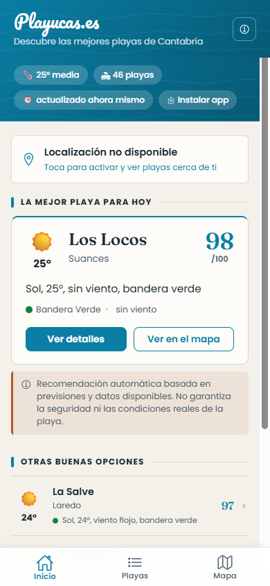
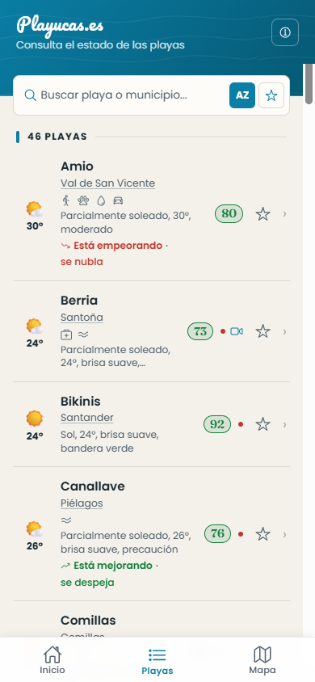
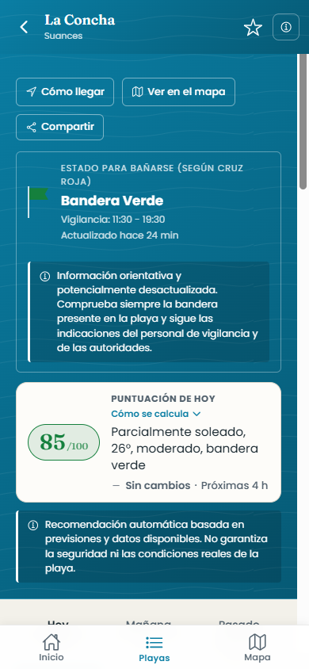
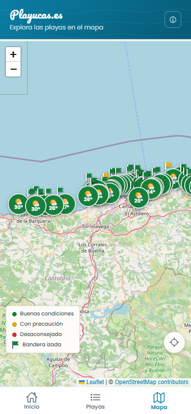

# 🏖️ Playucas.es
*Check the status of the beaches of Cantabria in real time: conditions score, 3-day forecasts with morning/afternoon detail, tides, UV index, weather warnings, and Red Cross flag status.*

---

[](../../releases)
[](./LICENSE.md)


Available languages: [Español](README.md) | **English**

## Production Demo

Try the app here: **[https://playucas.es/](https://playucas.es/)**

Backend API: `https://playas-cantabria.onrender.com`

> The repository, the Firebase project (`playas-cantabria-front`) and the Render service keep the historical `playas-cantabria` name; the public brand is **Playucas.es**.

## Preview

<p align="center">
  
  
  
  
</p>

## Features

* **"Best beach for today" home page:** automatic ranking of the catalog's beaches with a 0–100 conditions score (sky, wind, flag…), runner-up alternatives, and a clear notice that it is an indicative recommendation.
* **Beach listing** with search by name or municipality, A-Z / Z-A sorting, favorites, a per-beach conditions summary and trend (improving / worsening).
* **Beach detail:**
  * 3-day forecast with day selector and morning/afternoon breakdown: sky, wind and waves.
  * Max temperature, water temperature and thermal sensation; color-coded UV index; weather warnings with severity.
  * Hourly strip for the next few hours and imminent-rain notice (nowcast).
  * Tides: high and low tide times, with a real-time rising/falling indicator.
  * Flag and lifeguard coverage with its operator (Red Cross): status, coverage and schedule, with last-updated time.
  * **Share** button that renders today's reading as an image card, and a "Get directions" button (Google Maps).
  * Link to a webcam when the beach has a reliable one.
* **Interactive map** (Leaflet/OpenStreetMap) with conditions, hoisted flags and your location.
* **Municipality pages and curated landing pages**, prerendered along with every other route for SEO (sitemap and canonicals included).
* **Installable PWA** with partial offline mode: if the backend doesn't respond within 2.5s, the beach list is served from a local JSON file and updated when the server replies.
* **Bilingual:** Spanish and English interface.

## Data Sources

The app aggregates information from multiple sources with a fallback chain:

* **AEMET (XML/HTML scraping):** Enriched 3-day forecast, tides, warnings and real UV (primary source).
* **AEMET OpenData API:** 2-day forecast as fallback.
* **OpenWeatherMap:** Weather data, estimated UV and hourly-strip backup.
* **Open-Meteo:** Hourly precipitation for the rain nowcast.
* **Red Cross:** Flag status and lifeguard services (scraping).

In-memory cache with a configurable base TTL (default 1800s, scaled by time of day and season), a *stale* window that serves the last good value if a provider goes down, singleflight deduplication, and an optional second level on Upstash Redis.

> **Data licensing:** the license of this repository covers the code only. Data from AEMET, OpenWeatherMap, Open-Meteo, Red Cross, and OpenStreetMap belongs to its respective sources and is governed by their own terms (attribution required; ODbL in the case of OpenStreetMap). Anyone deploying this software takes on those obligations towards each data provider.

---

## Multi-region

The engine is region-agnostic: **a region is a data directory** under `regions/<id>/`, with its `region.json` (name, brand, map center, flag operators) and its `beaches.json` catalog. The backend validates every region at startup and mounts its API under `/api/<id>/…`; the frontend is built per region with `REACT_APP_REGION=<id>`, which injects that region's brand, map and catalog. Cantabria is the reference region; `regions/asturias/` exists as an example of a contributed region.

---

## Backend Architecture

The backend follows a **Hexagonal Architecture** (Ports and Adapters). Dependencies always point inward: `infrastructure → application → domain`.

### Layers

1. **`Domain` (Core)**
   * Entities: `Beach`, `Weather`, `Flag`, `Tides`, `BeachForecast`, `RainNowcast`, `Sunshine`.
   * Ports (interfaces): `BeachRepository`, `WeatherProvider`, `FlagProvider`, `TidesProvider`.
   * Use cases: `GetAllBeaches`, `GetBeachById`, `GetBeachDetails`, `GetFeaturedBeaches` (with `BeachScorer`), `GetRainNowcast`.
   * **No dependencies** on other layers.

2. **`Application` (Orchestration)**
   * DTOs: `BeachDTO`, `BeachDetailsDTO`.
   * Mappers: `BeachMapper`, `BeachDetailsMapper`, `FeaturedBeachMapper`, `LegacyDetailsMapper`.
   * Services: `DetailsAssembler` and `LegacyDetailsAssembler` (orchestrate the fallback chain).
   * Validation: Zod schemas for route params.

3. **`Infrastructure` (Outside)**
   * Express: server, routes, middlewares (CORS, rate limit, errors).
   * Providers: `AemetBeachWebScraper`, `AemetBeachForecastProvider`, `AemetWeatherProvider`, `OpenWeatherWeatherProvider`, `OpenMeteoPrecipitationProvider`, `RedCrossFlagProvider` and `FlagProviderRouter` (dispatches by flag operator).
   * Repository: `JsonBeachRepository` (reads the region's JSON catalog).
   * Cache: `InMemoryCache` with TTL and singleflight, with an optional L2 on Upstash Redis.
   * DI: manual container without a framework (`dependencies.ts`), one per valid region.

### Fallback Chain (beach detail)

```
Layer 1: AemetBeachWebScraper        → public XML/HTML from aemet.es (3 days, morning/afternoon, tides, warnings, UV)
Layer 2: AemetBeachForecastProvider  → OpenData API with API key (2 days)
Layer 3: OpenWeatherWeatherProvider  → OpenWeather API (temp, wind, description)
Layer 4: GetBeachDetails             → AEMET observation ↔ OpenWeather (hedged, first to respond wins)
```

---

## Tech Stack

### Backend

* **Language:** [TypeScript](https://www.typescriptlang.org/) v5.5
* **Runtime:** [Node.js](https://nodejs.org/) v20+
* **Framework:** [Express.js](https://expressjs.com/) v4.19
* **Architecture:** Hexagonal (Ports and Adapters) with manual DI.
* **Validation:** [Zod](https://zod.dev/)
* **HTTP:** [Axios](https://axios-http.com/)
* **Scraping:** [Cheerio](https://cheerio.js.org/)
* **Encoding:** [iconv-lite](https://github.com/ashtuchkin/iconv-lite) (AEMET serves ISO-8859-15)
* **Tests:** [Vitest](https://vitest.dev/)
* **Deployment:** [Render](https://render.com/) (primary), [Firebase Functions](https://firebase.google.com/docs/functions) (alternative)

### Frontend

* **Framework:** [React](https://reactjs.org/) 18 (Create React App)
* **UI Framework:** [Ionic](https://ionicframework.com/) React
* **Language:** [TypeScript](https://www.typescriptlang.org/)
* **Router:** [React Router](https://reactrouter.com/)
* **Maps:** [Leaflet](https://leafletjs.com/) / [react-leaflet](https://react-leaflet.js.org/) with OpenStreetMap
* **Mobile Platform:** [Capacitor](https://capacitorjs.com/)
* **Tests:** Jest + React Testing Library (characterization suite)
* **Web Deployment:** [Firebase Hosting](https://firebase.google.com/docs/hosting) (one site per region)

---

## Project Structure

```
playas-cantabria/
├── regions/                  # Per-region data: region.json + beaches.json
│   ├── cantabria/
│   └── asturias/
├── backend/
│   └── src/
│       ├── domain/           # Entities, ports, domain services, use cases
│       ├── application/      # DTOs, mappers, services, validation
│       ├── infrastructure/   # Express, providers, cache, DI, repositories, config
│       └── regions/          # Runtime region registry and validation
├── frontend/
│   └── src/
│       ├── app/              # Entry point, routes and theme (CSS variables)
│       ├── pages/            # Home, listing, detail, map, municipalities, landings, legal
│       ├── modules/          # share (image card), favorites, PWA install
│       ├── shared/           # i18n (es/en), SEO/prerender, config, geo, formatting, UI
│       ├── services/         # API client
│       └── data/             # Local catalog fallback (generated at build time)
└── docs/                     # Screenshots and documentation
```

---

## Getting Started

### Prerequisites

* **Node.js** v20+
* **npm** (or another package manager)

### Installation

```bash
git clone https://github.com/oscaruiz/playas-cantabria.git
cd playas-cantabria

# Backend
cd backend
npm install
cp .env.example .env
# Fill .env with your API keys

# Frontend
cd ../frontend
npm install
```

### Running

You need two terminals:

```bash
# Terminal 1 — Backend (http://localhost:4000)
cd backend
npm run dev

# Terminal 2 — Frontend (http://localhost:3000)
cd frontend
npm start
```

### Tests

```bash
cd backend && npm test    # Vitest
cd frontend && npm test   # Jest + RTL (always restores the Cantabria region)
```

---

## API — Endpoints

The API is multi-region: every route lives under `/api/:region/…`.

| Method | Route | Description |
|--------|-------|-------------|
| GET | `/api/:region/beaches` | List of all beaches in the region |
| GET | `/api/:region/beaches/featured` | Conditions ranking (score per beach) |
| GET | `/api/:region/beaches/:id` | Basic information for a beach |
| GET | `/api/:region/beaches/:id/details` | Full detail: 3-day forecast, tides, flag, coordinates |

The historical region-less routes (`/api/beaches…`) remain as deprecated Cantabria aliases for already-installed clients. Everything under `/api` is rate-limited to 60 requests/minute per IP.

### Examples

```bash
# Listing (Cantabria)
curl "http://localhost:4000/api/cantabria/beaches"

# Full detail (La Concha, Suances)
curl "http://localhost:4000/api/cantabria/beaches/3908503/details"
```

The `/details` endpoint consolidates data from **AEMET, OpenWeatherMap, Open-Meteo and the flag operator**, and includes a 3-day forecast with morning/afternoon detail, tides (high/low), UV index, weather warnings and GPS coordinates.

---

## Environment Variables

### Backend (`.env`)

| Variable | Description | Default |
|----------|-------------|---------|
| `PORT` | Server port | `4000` |
| `AEMET_API_KEY` | AEMET OpenData API key | — |
| `OPENWEATHER_API_KEY` | OpenWeatherMap API key | — |
| `CORS_ORIGIN` | Allowed CORS origin | `*` |
| `CACHE_TTL_SECONDS` | Base provider TTL in seconds (scaled by time of day and season) | `1800` |
| `FEATURED_FRESH_TTL_SECONDS` | Fresh window of the ranking before a background refresh | `300` |
| `FEATURED_STALE_TTL_SECONDS` | Maximum time the last valid ranking can be served | `3600` |
| `DETAILS_FRESH_TTL_SECONDS` | Fresh window of the consolidated detail | `60` |
| `DETAILS_STALE_TTL_SECONDS` | Maximum time a previous detail can be served while refreshing | `600` |
| `UPSTASH_REDIS_REST_URL` / `UPSTASH_REDIS_REST_TOKEN` | Optional; enable the two-level cache that survives restarts | — |
| `DEBUG_WEATHER` | `1` enables detailed provider logs | — |

### Frontend

| Variable | Description | Default |
|----------|-------------|---------|
| `REACT_APP_API_BASE_URL` | Backend URL | `https://playas-cantabria.onrender.com` |
| `REACT_APP_REGION` | Region this build serves | `cantabria` |
| `REACT_APP_SITE_ORIGIN` | Public origin of the deployment (canonicals, sitemap, manifest) | — |

---

## Contributing

Contributions are welcome. If you have ideas, suggestions, or want to report a bug, open an *issue* in this repository. Before submitting a PR, please read [CONTRIBUTING.md](./CONTRIBUTING.md).

---

## License
This project is distributed under the [PolyForm Shield 1.0.0](./LICENSE.md) license. It allows using, studying, modifying, forking and contributing to the software, and reusing it in projects that do not compete with Playucas. It does not allow offering a product that competes with Playucas, even for free. It is a *source-available* license; it is not open source under the OSI definition.

The "Playucas" name, logo and visual identity are not covered by the software license: see [TRADEMARK.md](./TRADEMARK.md).

## Versioning
This project follows [Semantic Versioning](https://semver.org/).
Currently at **v2.1.0**.

## Roadmap

- [x] ~~Add **tides** data~~
- [x] ~~Add more beaches~~ (46 Cantabria beaches in the catalog)
- [ ] Improve the **frontend** architecture (state, discriminated types, caching)
- [ ] Publish **OpenAPI/Swagger** for the API
- [ ] Basic E2E tests (Playwright) for the main flows
